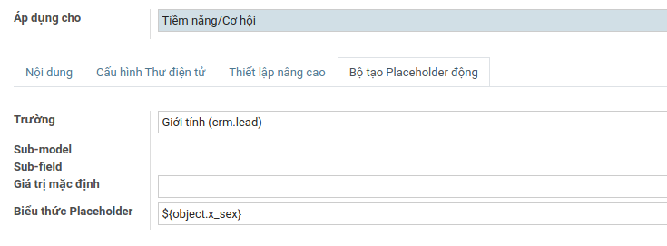

## Mục lục
- [[#Chọn đối tượng người nhận|Chọn đối tượng người nhận]]
- [[#Lọc danh sách người nhận|Lọc danh sách người nhận]]
- [[#Tạo và quản lý Mailing Contact - Danh sách liên hệ mail|Tạo và quản lý Mailing Contact - Danh sách liên hệ mail]]
	- [[#Cách 1: Tạo từ giao diện mailings|Cách 1: Tạo từ giao diện mailings]]
	- [[#Cách 2: Tạo từ giao diện CRM|Cách 2: Tạo từ giao diện CRM]]
- [[#Tạo và quản lý Mailing list - danh sách gửi mail|Tạo và quản lý Mailing list - danh sách gửi mail]]
- [[#Tạo và quản lý Email templates|Tạo và quản lý Email templates]]

# Gửi email cho cơ hội thông qua giao diện CRM

Truy cập module `Bsmart` --> chọn `CRM` --> chọn `My Pipeline` --> Chọn vào biểu tượng List View

Sau đó sử dụng bộ lọc để chọn ra các cơ hội mong muốn, theo ví dụ ở dưới ta sẽ chọn ra những `cơ hội` đang thuộc `level 4`. Tiếp theo đánh dấu các cơ hội, nhấn vào `Hành động`, chọn `Gửi mail`

Sau đó chúng ta sẽ có giao diện gửi email 

Chú thích giao diện:
- **`1`**: Địa chỉ người gửi
- **`2`**: Chủ đề (Subject) của email
- **`3` và `4`**: Nếu trong trường hợp chúng ta muốn email này thuộc về một chiến dịch gửi mail (`Email campaign`) thì nhập tên chiến dịch đó vào (số 3) và soạn tên của email để lưu trong chiến dịch (số 4).*** Còn nếu không, để trống***
- **`5`**: Nội dung email
- **`6`**: Trong trường hợp có sẵn email templates, lựa chọn template cần thiết và chỉnh sửa nội dung email nếu cần

# Gửi email thông qua giao diện Mailing

Truy cập module `Bsmart` --> chọn `Mailing` --> chọn `Mailing`

Tại đây, ta có giao diện Kanban về các mailing và trạng thái của chúng
Nhấn vào nút `Tạo`, để vào giao diện tạo 1 mailing mới. Mailing cũng có thể được xem như một email, nhưng chỉ có các mailing mới có thể được xem và quản lý ở giao diện `Mailing` này

Chú thích giao diện:
- **`1`**: Chủ đề (Subject) của email
- **`2`**: Đối tượng người nhận (xem thêm ở [Chọn đối tượng người nhận](#Chọn%20đối%20tượng%20người%20nhận))
- **`3`**: Danh sách người nhận đã qua bộ lọc (xem thêm ở [Lọc danh sách người nhận](02%20-%20Gửi%20email.md#Lọc%20danh%20sách%20người%20nhận))
- **`4`**: Trong trường hợp có sẵn email templates, lựa chọn template cần thiết và chỉnh sửa nội dung email nếu cần
- **`5`**: Nội dung email

Sau khi hoàn thành soạn thảo email
- Nhấn `Gửi` để server đưa email vào hàng chờ để xử lý gửi đi

- hoặc nhấn `Ấn định (thời gian)` để chọn ngày gửi, khi tới thời hạn, server sẽ đưa mailing này vào hàng chờ để xử lý gửi đi

- hoặc nhấn `Kiểm thử`, và nhập email nhận để kiểm tra tính khả dụng của mailing (gửi được, nội dung được bảo toàn, ...)

- Hoặc nhấn `Lưu` để lưu lại mailing này và gửi sau, những mailings này nằm ở cột Nháp

## Chọn đối tượng người nhận

Chúng ta có các đối tượng sau:
- `Danh bạ`: là bao gồm các bản ghi trong phần contacts (`Customer`, `Employees`, `Companies`)

- `Mailing Contact`: là bao gồm các bản ghi về người nhận được quản lý bởi `mailing` (xem thêm ở [Tạo và quản lý Mailing Contact](02%20-%20Gửi%20email.md#Tạo%20và%20quản%20lý%20Mailing%20Contact))

- `Tiềm năng/Cơ hội`: bao gồm các bản ghi ở trong `CRM` như cơ hội

- `Danh sách Mailing`: bao gồm các danh sách người nhận đã được tạo và quản lý bởi `Mailing` (xem thêm ở [Tạo và quản lý Mailing list](02%20-%20Gửi%20email.md#Tạo%20và%20quản%20lý%20Mailing%20list))

## Lọc danh sách người nhận
Sau khi nhấn vào nút hiện bản ghi, chúng ta giao diện list view cùng với bộ lọc. Như ví dụ dưới, chọn ra những bản ghi được tạo vào tháng 6

Sau khi nhấn `chọn`, trong trường hợp này, hãy chỉnh lại luật áp dụng cho các bộ lọc từ `Bất kì` thành `Tát Cả`.

Và như vậy ta đã thành công lọc danh sách người nhận xuống còn 3.

## Tạo và quản lý Mailing Contact - Danh sách liên hệ mail
Khái niệm `Mailing contact` dùng để lưu trữ các bản ghi chủ yếu để ***dễ dàng tái sử dụng cho việc gửi mailing sau này***. Bản ghi này chủ yếu lưu tên và email của một người.

### Cách 1: Tạo từ giao diện mailings
Chọn `Mailing` --> Chọn `Mailing List Contacts`

Nhấn `Tạo`, sau đó chúng ta sẽ có giao diện thêm mailing contacts

Chú thích giao diện:
- **`1`**: Tên của bản ghi này
- **`2`**: Email của bản ghi
- **`3`**: Danh sách mailing, là danh sách các Mailing list mà bản ghi này thuộc về. Có thể để trống

Sau khi điền đủ thông tin cần thiết, nhấn `Lưu`

### Cách 2: Tạo từ giao diện CRM
Truy cập module `Bsmart` --> chọn `CRM` --> chọn `My Pipeline` --> Chọn vào biểu tượng List View

Sau đó sử dụng bộ lọc để chọn ra các `cơ hội` mong muốn. Nhấn vào `Hành động` --> `Convert to mail contacts`

Tại đây, chúng ta có thể thêm các Mailing List - danh sách gửi mail, mà chúng ta muốn các bản ghi này được thêm vào. Hoặc có thể để trống và chỉ chuyển đổi thông tin các cơ hội này thành những `Mailing contacts`

Nhấn `Convert`

Hoặc trong trường hợp ta chỉ cần convert 1 cơ hội duy nhất, ta có thể nhấn vào thẻ Kanban của cơ hội đó và nhấn `Convert lead to email contact`

## Tạo và quản lý Mailing list - danh sách gửi mail
Chọn `Mailing` --> Chọn `Mailing list`

Mailing lists là các danh sách chứa các liên hệ (`mailing contact`), Một `Mailing list` bao gồm tên của mailing list đó và danh sách 

Nhấn vào `Tạo`, sau đó nhập tên của Mailing list vào. Chọn `Tạo` để hoàn tất.

Lúc này mailing list này vẫn chưa có bất kì `Mailing contacts` nào, vì vậy để thêm vào, ta quay lại phần `Mailing list contacts`, chọn vào bản ghi mong muốn, và thêm mailing list vừa tạo vào phần `Danh sách mailing`, sau đó nhấn Lưu.

Như vậy ta vừa cập nhật thêm 1 bản ghi cho mailing list (danh sách mail) "Danh sách người nhận mail". Xem cách thêm nhiều bản ghi vào trong mailing list ở phần [tạo mailing contacts từ giao diện CRM](02%20-%20Gửi%20email.md#Cách%202%20Tạo%20từ%20giao%20diện%20CRM)  

## Tạo và quản lý Email templates
*Yêu cầu: tài khoản thực hiện hành động phải là tài khoản có các quyền Admin về Settings**

Đầu tiên ta cần phải bật "Developers mode" - Chế độ phát triển

Chọn module `Thiết lập`, sau đó kéo xuống đến khi thấy phần `Developer Tools`. Sau đó nhấn `Kích họat chế độ phát triển`.

Sau đó, nếu thành công, ta sẽ thấy biểu tượng có hình con bọ hiện ra ở thanh navigation

Tiếp theo, vẫn ở module `Thiết lập`, chọn `Kỹ thuật`, ở trong mục `Emails`, chọn `các mẫu`.

Sau đó chọn `Tạo`, và chúng ta sẽ có giao diện của phần tạo email template

Chú thích giao diện:
- **`1`**: Tên của template

- **`2`**: Model/Đối tượng mà template này áp dụng lên (ví dụ: `Cơ hội`, `Liên Hệ`, ...)

- **`3`**: Nội dung email template, bao gồm Subject và Body

- **`4`**: Cấu hình thư điện tử, sử dụng để cấu hình các thông tin như email người gửi, email người nhận, email CC, ...

- **`5`**: Thiết lập nâng cao, thông thường chúng ta chỉ sử dụng nó nếu như ta cần cân bằng tải cho nhiều mail server. Còn nếu không, ta có thể không quan tâm tới điều chỉnh này

- **`6`**: Bộ tạo placehodler động, đây là công cụ để cá nhân hóa email. Sau khi chọn `Áp dụng cho`, thì ta có thể chọn trường thông tin cần thiết để lấy biến placeholder, sau đó ghi vào trong mail body

Ở hình dưới là ví dụ về cách sử dụng place holder trong mail body
