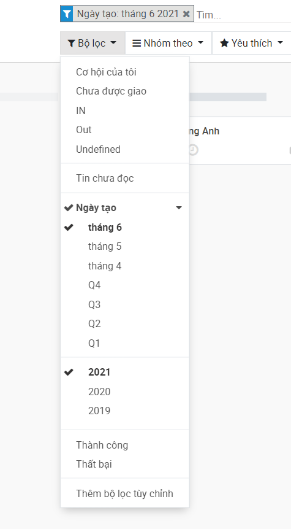

## Tạo cơ hội mới
Chọn module `bsmart CRM` --> `CRM` --> `My Pipeline`

Lúc này ta sẽ có giao diện quản lý CRM.

Chú thích giao diện:
- **`1`**: Danh sách các cơ hội được trình bày theo bảng Kanban hoặc dưới dạng danh sách

- **`2`**: Bộ lọc company. Bộ lọc này sẽ chọn theo danh sách `Allowed companies` (Xem thêm ở phần hướng dẫn [Tạo tài khoản](01%20-%20Quản%20lý%20tài%20khoản%20nhân%20viên.md#Cách%201%20Tạo%20tài%20khoản%20qua%20giao%20diện%20Contacts%20Employees))

- **`3`**: Thanh tìm kiếm và bộ lọc các cơ hội.    
### Cách 1: Tạo cơ hội thủ công
Nhấn vào nút `Tạo`, lúc này ta sẽ có giao diện tạo nhanh cơ hội

Trường thông tin quan trọng nhất và bắt buộc ở đây là `Tên`, các trường thông tin còn lại có thể để trống nếu không cần thiết. Vì đây chỉ là giao diện tạo nhanh, nên nó không cung cấp cho ta chỉnh sửa các trường thông tin chi tiết khác.

Nhấn nút `Sửa` để có thể thêm các thông tin chi tiết khác qua giao diện đầy đủ của cơ hội hoặc nhấn `Thêm` để thêm luôn cơ hội này vào Level thấp nhất - `Level 1`.

Trong trường hợp ta chọn `Sửa`, sau khi hoàn thành nhập dữ liệu, chọn `Lưu`

Ở list view - xem dạng lưới, khi nhấn nút `Tạo`, ta sẽ vào thẳng giao diện chi tiết giống hình trên thay vì có giao diện tạo nhanh như ở bảng Kanban

### Cách 2: Import từ tập tin `.xlsx`

Chọn nút `Nhập` để bắt đầu quá trình nhập tập tin. Sau đó nhấn nút `Nạp tập tin` để chọn file từ máy tính. Lưu ý định dạng file phải là excel `.xls` hoặc `.xlsx`

Đảm bảo rằng `The first row contains the label of the column` được đánh dấu. Vì ở file nhập liệu chuẩn, dòng đầu tiên chứa tên của các trường thông tin thay vì dữ liệu.

Sau đó ghép các trường thông tin ứng với những cột tương ứng. Nếu như tên cột GIỐNG (không quan trọng viết hoa hay thường) với tên của một trường dữ liệu (data field), thì hệ thống sẽ tự động chọn trường dữ liệu cho cột đó.

***Lưu ý***: trường hợp mặc dù tên cột "khớp" với 1 trường thông tin nhất định mà hệ thống không tự nhận được
1. Kiểm tra khoảng trắng dư thừa ở tên cột. Xóa tất cả các khoảng trắng sau kí tự cuối
2. Kiểm tra lại "ngôn ngữ" ở `Tùy chỉnh cá nhân`, vì một số trường thông tin có chế độ song ngữ nên khi ở ngôn ngữ tiếng anh nó sẽ cố tìm tên cột giống với bản dịch tiếng anh đó thay vì bản dịch tiếng việt gốc 
3. Trong tường hợp hệ thống vẫn không tự nhận được, tiến hành chọn thủ công. Về sau hệ thống sẽ tự ghi nhớ tên cột đó ứng với trường thông tin bạn chọn ở những lần import excel sau này

Sau đó nhấn `Kiểm thử`, ta sẽ nhận được thông báo về những lỗi nếu có (dữ liệu không phù hợp, dữ liệu đã tồn tại ...)
Nếu nhận được thông báo `Mọi thứ dường như hợp lệ`. Tiến hành chọn `Nhập`.

Trong trường hợp ta muốn cập nhật file nhập, chọn `Nạp tập tin` và tải lên file mới.

## Chọn companies - công ty/bộ phận
Trong CRM, phân quyền giữa các `Companies` (công ty/bộ phận) là phân quyền cao nhất. Vì vậy khi thực hiện các hành động, cần chú ý tới danh sách Companies bạn đang bật.

Phân quyền này ảnh hưởng tới những cơ hội được hiện ra (mỗi một công ty/bộ phận có pipeline riêng). Ở hình ví dụ trên, khi chỉ chọn `THCS-THPT` thì ta chỉ có 1 cơ hội `Nguyễn Hoàng Anh` ở Level 4. Chọn tất cả các option còn lại để hiện hết tất cả các cơ hội ở tất cả các pipeline. 

Đối với các tài khoản nhân viên thuộc nhiều `companies`, sau mỗi lần login lại, bộ chọn `companies` này sẽ được ***reset về chỉ chọn*** `Default company`. Vì vậy hãy chọn `Default Companies` phù hợp với tài khoản nhân viên để tránh trường hợp cơ hội/khách hàng thất lạc vào pipeline không đúng. 

## Tổng quan về xem danh sách - List view
Tuy bảng KANBAN cung cấp cho ta sự trực quan về các cơ hội, nhưng đôi lúc ta cần nhiều thông tin chi tiết để làm các công việc nâng cao. Đó là lúc ta sẽ sử dụng List view - xem danh sách.

Để truy cập `list view` nhấn vào biểu tượng ở vị trí được miêu tả theo hình ở dưới 

Khi ở list view, ta được trình bày bảng danh sách với các trường thông tin chi tiết. Ta có thể tùy chỉnh bảng này bằng cách ***kéo ngang*** hết về bên phải sau đó nhấn vào biểu tượng "3 dấu chấm dọc" như hình dưới.

Ở đây ta chọn vào những trường thông tin ta muốn và bỏ chọn những trường thông tin không cần thiết

Ta cũng có thể sort - sắp xếp theo thứ tự tăng hay giảm dần bằng cách nhấn vào cột đó. Ở hình dưới là ví dụ về sort theo ngày tạo tăng dần

Để phục vụ những yêu cầu tìm kiếm và lựa chọn phức tạp, kết hợp `List view` và `bộ lọc` cùng với `nhóm theo` (Xem thêm ở phần [Lọc cơ hội - filter](03%20-%20Quản%20lý%20cơ%20hội.md#Lọc%20cơ%20hội%20-%20filter) và [Nhóm các cơ hội - group by](03%20-%20Quản%20lý%20cơ%20hội.md#Nhóm%20các%20cơ%20hội%20-%20group%20by))
## Lọc cơ hội - filter
Trước khi bắt đầu sử dụng tìm kiếm, đảm bảo về những pipeline mà chúng ta muốn có kết quả bằng cách kiểm tra danh sách `Companies`. 

Về cơ bản, chúng ta sẽ sử dụng nút `Bộ lọc` với những lựa chọn sẵn có, hoặc tạo và tái sử dụng các bộ lọc bằng cách dùng `Yêu thích`

### Ví dụ 1: Sử dụng options sẵn có - Lọc theo thời gian tạo
Giả sử chúng ta muốn chọn ra các cơ hội được tạo từ tháng 6 năm 2021, nhấn vào `Bộ lọc` --> `Ngày tạo`, chọn năm `2021` và `tháng 6`.

Trong trường hợp ta muốn kết hợp nhiều bộ lọc với nhau, chỉ cần chọn thêm các thông lựa chọn phù hợp. Ví dụ như ta cần lọc thêm những cơ hội được đánh là `IN`

Lưu ý là những bộ lọc được áp dụng đều hiển thị ở thanh tìm kiếm. Nếu như muốn gỡ bỏ thì chỉ cần click vào dấu `X` ở các lực chọn lọc đó 

### Ví dụ 2: Tạo bộ lọc tùy chỉnh - Lọc theo giới tính
Đôi khi ta cần nhiều hơn những lựa chọn sẵn có hoặc trong một số trường hợp nào đó, những yêu cầu đặc biệt xuất hiện đòi hỏi sự tùy biến nhất định.

Chọn `Bộ lọc` --> `Thêm bộ lọc tùy chỉnh`.
- **`1`**: là trường thông tin ta muốn lọc
- **`2`**: là toán tử tương ứng với trường thông tin đó (lớn hơn, nhỏ hơn, chứa, là, ...)
- **`3`**: là giá trị để kết hợp với toán tử

Sau đó nhấn `áp dụng`

### Lưu lại bộ lọc đang áp dụng
Nếu như ta muốn lưu lại những kết quả lọc đang thực hiện cho việc tái sử dụng sau này
Nhấn vào `Yêu thích`--> `Save current search`

Lúc này nhập tên của filter vào ô trống để lưu.
- `Sử dụng mặc định`: nếu chọn, thì mỗi lần truy cập `CRM`, bộ lọc này sẽ được áp dụng
- `Chia sẻ với tất cả người dùng`: Lưu ý, chỉ có Admin mới có thể sử dụng chức năng này. Nếu chọn, sau khi lưu lại bộ lọc, tất cả nhân viên đều có thể sử dụng lại bộ lọc này. 

Nhấn `Lưu`.

Việc tái sử dụng các bộ lọc đã lưu có thể thực hiện bằng cách nhấn vào `Yêu thích` và chọn bộ lọc đó. Việc xóa chỉ cần nhấn vào icon thùng rác

## Nhóm các cơ hội - group by
Khác với Bộ lọc, `Nhóm theo` ***không ảnh hưởng*** tới các cơ hội được hiện (ẩn những cơ hội không thỏa điều kiện), ***mà chỉ đơn giản sắp xếp lại cách chúng được thể hiện***

Ở chế độ mặc định, các cơ hội được nhóm theo các Level, vì vậy ta thấy những cơ hội đó được sắp xếp theo các cột với level tương ứng của chúng.

Khi sử dụng `Nhóm theo`, ta sẽ thay đổi tính chất của các cột Kanban này. Ở hình dưới là ví dụ về việc nhóm theo `Giới Tính` thay vì `Level/Giai đoạn` như mặc định.

Cách sử dụng `Nhóm theo` cũng tương tự như sử dụng `Bộ lọc`. Ta cũng có thể `thêm nhóm tùy chỉnh` giống như cách `thêm bộ lọc tùy chỉnh`

Và đồng thời ta cũng có thể thêm phần nhóm theo này vào `Yêu thích` để sử dụng sau này

Và dĩ nhiên, ta cũng có thể kết hợp `bộ lọc` cùng với `nhóm theo`. Ở ví dụ bên dưới, ta sẽ sử dụng nhóm theo `giới tính` kết hợp với bộ lọc `IN`
